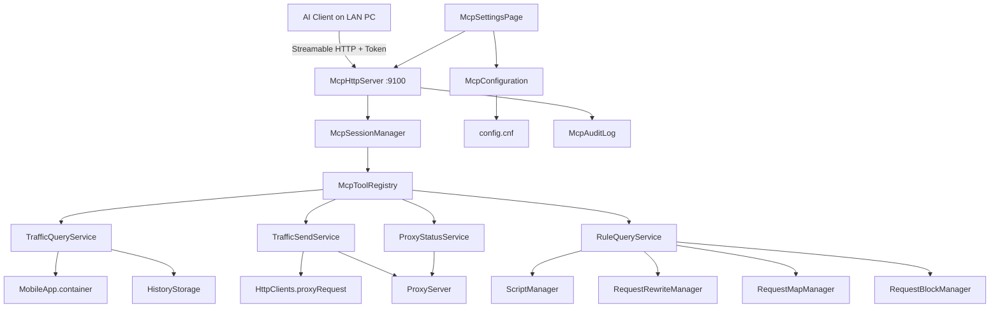

# Android APK 内嵌 MCP 服务

Feature Name: android-mcp-server
Updated: 2026-09-03

## Description

在 ProxyPin Android APK 进程内增加 MCP（Model Context Protocol）服务。同一局域网的 AI 客户端通过 Streamable HTTP 连接手机，使用 Auth Token 鉴权后：

- 读取当前抓包会话与 HAR 历史
- 发送新 HTTP(S) 请求或重放已捕获请求
- 只读查询代理状态与现有脚本/重写/映射/拦截规则

本期不在设备上执行 Python 或 JavaScript。AI 给出的脚本由用户在现有脚本设置页自行粘贴验证。桌面端本期不启用该服务。

MCP HTTP 默认端口 9100，与代理端口 9099 分离。流量正文默认截断 65536 字节，用户可在 MCP 设置页调整。`mcpEnabled` 持久化后，下次打开 APK 若开关为开启则自动拉起 MCP。

## Architecture



MCP 作为独立 HTTP 监听器与 `ProxyServer` 并行运行，共用同一 Dart isolate 与现有领域对象。流量读取走 `MobileApp.container` 与 `HistoryStorage`；发送/重放复用 `HttpClients.proxyRequest`，经本机代理端口走完整拦截器链，从而进入当前会话列表。

传输选型：Android 上使用 Streamable HTTP（JSON-RPC 2.0 over HTTP POST，可选 SSE 推送），因为 stdio 无法跨设备，SSE 是 MCP 远程场景的既有实践。

## Components and Interfaces

### McpConfiguration

持久化字段写入 `Configuration` / `config.cnf`，与代理端口同等序列化。

| 字段 | 默认 | 说明 |
|------|------|------|
| mcpEnabled | false | 用户开关；持久化后进程启动若为 true 则自动拉起 MCP |
| mcpPort | 9100 | MCP HTTP 端口 |
| mcpAuthToken | 随机生成 | 连接令牌 |
| mcpBodyLimit | 65536 | 单条 body 截断字节数 |

端口变更在下次启动 MCP 时生效。Token 重新生成后旧值立即失效。

### McpServer / McpHttpServer

职责：绑定 `InternetAddress.anyIPv4` 上的 `mcpPort`，处理 MCP Streamable HTTP。

主要路径：

- `POST /mcp`：JSON-RPC 请求（initialize、tools/list、tools/call、resources/list、resources/read）
- `GET /mcp`：SSE 会话（可选，用于 server 主动通知）
- `DELETE /mcp`：结束会话

鉴权：每个请求读取 `Authorization: Bearer <token>` 或 query `token`。不匹配则返回 HTTP 401。

生命周期由 `McpServerController` 管理，与 `ProxyServer.start/stop` 解耦：代理停掉时 MCP 仍可查询历史；发送/重放工具在代理未运行时返回业务错误。

Android 明文 HTTP：在 `android/app/src/main/AndroidManifest.xml` 保持 LAN 访问可用（现有抓包场景已允许 cleartext）。MCP 监听与代理监听同属用户主动开启的本机服务。

### McpSessionManager

维护已握手的 MCP 会话：session id、协议版本、已声明能力、最后活跃时间。关闭 MCP 开关时断开全部会话。UI 用会话数展示“连接中”。

### McpToolRegistry

注册本期工具，每个工具提供 name、description、input JSON Schema、handler。

| 工具名 | 对应需求 | 行为 |
|--------|----------|------|
| `list_traffic` | R3 | 列出当前会话摘要，支持 url/method/host/status/keyword、offset/limit |
| `get_traffic` | R3 | 按 requestId 返回完整请求/响应，body 按 mcpBodyLimit 截断 |
| `list_history` | R3 | 列出 HistoryItem 摘要 |
| `get_history_traffic` | R3 | 按 historyId 读取 HAR 条目，再按 requestId 或过滤条件返回 |
| `send_request` | R4 | 构造 HttpRequest，经本机代理发送 |
| `replay_request` | R4 | 按 requestId 复制并允许覆盖 method/url/headers/body |
| `get_proxy_status` | R5 | 运行状态、代理端口、enableSsl |
| `list_rules` | R5 | 只读返回 script/rewrite/map/block 规则摘要 |

不注册任何 execute_python / execute_js / update_rule 工具。未声明方法返回 MCP `Method not found`。

### TrafficQueryService

数据源优先级：

1. 当前会话：`MobileApp.container`（`ListenableList<HttpRequest>`）
2. 历史：`HistoryStorage.getRequests(HistoryItem)`

摘要字段：`requestId`、`method`、`url`、`status`、`contentType`、`durationMs`、`timestamp`、`bodySize`。

正文策略：对 request/response body 按 UTF-8 解码（二进制则 Base64），超过 `mcpBodyLimit` 截断并设置 `truncated=true`、`originalLength`。

### TrafficSendService

发送路径与移动端请求编辑器一致：

```text
HttpClients.proxyRequest(request, proxyInfo: ProxyInfo.of("127.0.0.1", proxyServer.port))
```

成功后响应进入 `EventListener.onRequest/onResponse`，自然写入当前会话。代理未运行时返回错误码 `proxy_not_running`。URL 无法解析时返回 `invalid_url`。

重放：按 requestId 在 container（必要时再查当前已加载的 history cache）定位 `HttpRequest`，`copy` 后应用覆盖字段再发送。

### RuleQueryService

只读聚合：

- `ScriptManager.list` -> `{id, name, url, enabled}`
- `RequestRewriteManager.rules` -> `{name, url, type, enabled}`
- `RequestMapManager.rules` -> `{name, url, enabled}`
- `RequestBlockManager.list` -> `{url, enabled}`

仅返回摘要字段：id、name、url、enabled。不返回脚本源码、重写内容或映射正文。不提供写回接口。

### McpSettingsPage（仅 Android）

入口：`lib/ui/mobile/menu/drawer.dart` 的 `_SettingPage` 增加 MCP 列表项，跳转 `lib/ui/mobile/setting/mcp.dart`。

页面内容：开关、端口输入、截断上限输入、Token 展示/复制/重新生成、连接 URL（`http://<localIp>:<port>/mcp`）、当前连接数、最近审计记录。

连接说明文本可一键复制，便于粘贴到 Claude/Cursor/OpenCode 的 MCP 配置。

### McpAuditLog

内存环形缓冲（最多 100 条），进程退出丢弃。字段：time、tool、summary、ok。发送与重放成功时写入。设置页展示。

## Data Models

```dart
class McpConfig {
  bool enabled;
  int port;          // default 9100
  String authToken;
  int bodyLimit;     // default 65536
}

class TrafficSummary {
  String requestId;
  String method;
  String url;
  int? status;
  String? contentType;
  int? durationMs;
  String timestamp;
  int? bodySize;
}

class TrafficDetail {
  TrafficSummary summary;
  Map<String, List<String>> requestHeaders;
  String? requestBody;
  bool requestBodyTruncated;
  int requestBodyOriginalLength;
  Map<String, List<String>>? responseHeaders;
  String? responseBody;
  bool responseBodyTruncated;
  int responseBodyOriginalLength;
}

class SendRequestInput {
  String method;
  String url;
  Map<String, String>? headers;
  String? body;
}

class ReplayRequestInput {
  String requestId;
  String? method;
  String? url;
  Map<String, String>? headers;
  String? body;
}

class RuleSummary {
  String kind; // script | rewrite | map | block
  String? id;
  String? name;
  String? url;
  bool enabled;
}

class AuditEntry {
  DateTime time;
  String tool;
  String summary;
  bool ok;
}
```

`Configuration.toJson/fromJson` 增加 `mcpEnabled`、`mcpPort`、`mcpAuthToken`、`mcpBodyLimit`。首次开启 MCP 且 token 为空时生成随机令牌。

## Correctness Properties

- MCP 监听端口与代理端口分离；默认 9100 vs 9099。
- 未携带匹配 Auth Token 的连接无法列出或读取任何 Traffic Record。
- `tools/list` 不包含代码执行或规则写入工具。
- `send_request` / `replay_request` 仅在 `ProxyServer.isRunning == true` 时发送。
- body 截断使用用户当前配置的 `mcpBodyLimit`，响应中同时给出 `truncated` 与 `originalLength`。
- 关闭 MCP 开关后所有会话结束，端口释放。
- 规则查询不修改 `ScriptManager` / `RequestRewriteManager` / `RequestMapManager` / `RequestBlockManager` 的持久化文件。
- 发送的请求走本机代理，因此会出现在当前 Captured Session 中。

## Error Handling

| 场景 | HTTP / MCP 行为 |
|------|-----------------|
| Token 缺失或不匹配 | HTTP 401，审计记失败 |
| 端口占用 | 启动失败，UI 展示原因，开关保持关闭 |
| requestId 不存在 | MCP 错误 `not_found` |
| 历史条目不存在 | MCP 错误 `not_found` |
| URL 非法 | MCP 错误 `invalid_url` |
| 代理未运行且调用发送/重放 | MCP 错误 `proxy_not_running` |
| 未知工具名 | MCP `Method not found` |
| 读取/发送过程异常 | 捕获后返回可读消息，代理继续运行 |
| body 超限 | 成功返回截断正文，非错误 |

## Test Strategy

1. **协议单测**：对 JSON-RPC 处理层喂 initialize / tools/list / 未知方法，断言 serverInfo、工具清单不含执行类工具、未知方法错误码。
2. **鉴权单测**：无 token、错误 token 被拒绝；正确 token 可 list_traffic。
3. **流量查询单测**：向内存 container 放入若干 `HttpRequest`，验证过滤、分页、requestId 详情、body 截断标记。
4. **历史查询单测**：用临时 HAR 文件构造 `HistoryStorage` 条目，验证 list_history 与 get_history_traffic。
5. **发送/重放单测**：代理未启动时 send/replay 返回 `proxy_not_running`；启动后 replay 覆盖字段生效（可用本地回环测试服务器）。
6. **规则只读单测**：list_rules 返回摘要且不调用 flushConfig。
7. **配置持久化单测**：mcpPort / mcpBodyLimit / token 写入 `toJson` 后再 `fromJson` 还原。
8. **Android UI 手工**：设置页开关、复制 URL、改端口/截断上限、看连接数与审计；电脑同 Wi-Fi 用 MCP 客户端连入。

不在本期覆盖：设备端 Python/JS 执行、规则写入、桌面端 MCP、TLS 终止 MCP（明文 HTTP + Token）。

## References

[^1]: (Filename) - 代理生命周期与拦截器链 (当前工作区 `/lib/network/bin/server.dart`)
[^2]: (Filename) - 拦截器钩子 (当前工作区 `/lib/network/components/interceptor.dart`)
[^3]: (Filename) - 移动端会话容器 (当前工作区 `/lib/ui/mobile/mobile.dart`)
[^4]: (Filename) - 历史 HAR 存储 (当前工作区 `/lib/storage/histories.dart`)
[^5]: (Filename) - 请求发送 (当前工作区 `/lib/network/http/http_client.dart`)
[^6]: (Filename) - 运行时配置序列化 (当前工作区 `/lib/network/bin/configuration.dart`)
[^7]: (Filename) - JS 脚本管理（只读查询数据源） (当前工作区 `/lib/network/components/manager/script_manager.dart`)
[^8]: (Website) - MCP 规范 Streamable HTTP 传输 https://modelcontextprotocol.io/specification/2025-03-26/basic/transports
