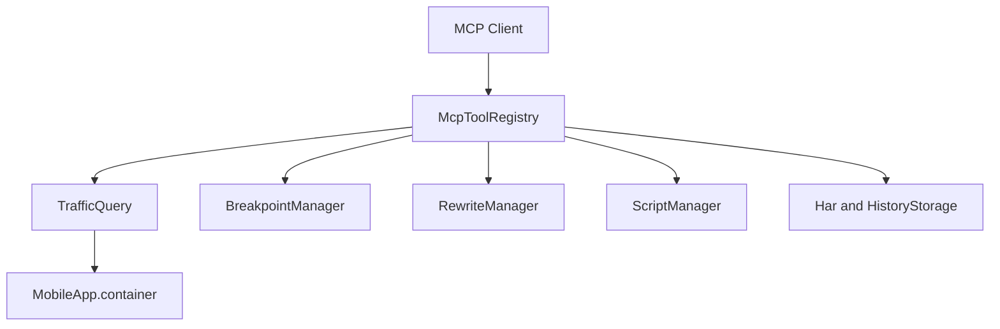

# MCP 27 工具清单

Feature Name: mcp-tools-27
Updated: 2026-09-05

## Description

把仓库内置的 27 个 MCP 工具注册到 `McpToolRegistry`。流量查询复用当前会话与历史缓存；断点/重写/脚本走现有 Manager；HAR 走 `Har` 与 `HistoryStorage`；代码生成复用 `curlRequest`、`copyAsPythonRequests`、`copyAsFetch`。

## Architecture

## Components and Interfaces

工具实现集中在 `lib/network/mcp/mcp_tools.dart`。`list_traffic` / `get_traffic` 作为 `get_request_list` / `get_request_detail` 的别名保留。

`RequestBreakpointInterceptor` 增加 `pendingRequestIds` / `pendingResponseIds`，供 `get_pending_intercepts` 与 `release_intercept` 使用。

## Data Models

工具入参沿用 JSON Schema。过滤字段统一为 url、method、host、status、keyword、offset、limit。

## Correctness Properties

- tools/list 必须包含全部 27 个清单名称。
- 写操作（断点、重写、脚本、HAR 导入）成功后写入审计日志。
- 正文读取遵守 `mcpBodyLimit` 截断。

## Error Handling

缺失 requestId / 规则使用 `not_found`。非法 URL、HTTP method、HAR JSON 使用 invalid params 或 `invalid_url`。

## Test Strategy

- `test/mcp_protocol_test.dart` 断言 27 个工具名出现在 tools/list。
- `test/mcp_traffic_test.dart` 覆盖列表、统计、Cookie、对比、代码生成、敏感信息、鉴权与端点提取。

## References

- 当前工作区 `/lib/network/mcp/mcp_tools.dart`
- 当前工作区 `/.monkeycode/specs/android-mcp-server/design.md`
